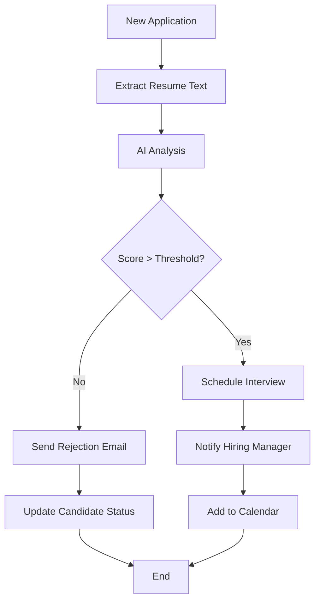
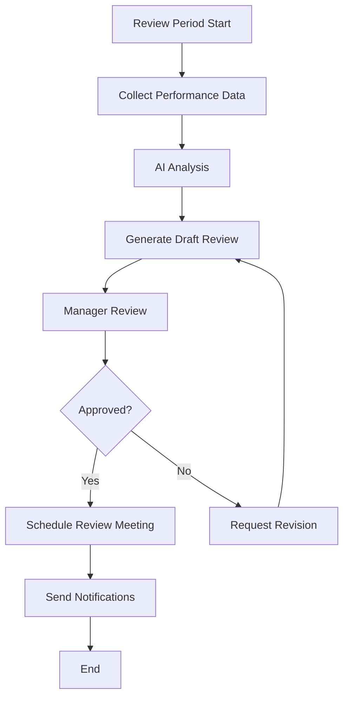
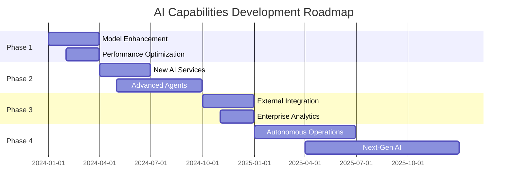

# Dokumentasi Lengkap AI Capabilities - Horilla HR System

## Daftar Isi

1. [Overview AI Capabilities](#overview-ai-capabilities)
2. [Budget AI Service](#budget-ai-service)
3. [Knowledge AI Service](#knowledge-ai-service)
4. [Indonesian NLP Service](#indonesian-nlp-service)
5. [RAG + N8N Integration Service](#rag--n8n-integration-service)
6. [Agentic AI dengan N8N Workflows](#agentic-ai-dengan-n8n-workflows)
7. [Implementasi dan Deployment](#implementasi-dan-deployment)
8. [Monitoring dan Performance](#monitoring-dan-performance)
9. [Batasan dan Keterbatasan](#batasan-dan-keterbatasan)
10. [Roadmap Pengembangan](#roadmap-pengembangan)

---

## Overview AI Capabilities

### Deskripsi Umum

Sistem AI Horilla HR merupakan platform terintegrasi yang menggabungkan berbagai teknologi AI untuk mengotomatisasi dan meningkatkan efisiensi proses HR. Sistem ini dibangun dengan arsitektur modular yang memungkinkan setiap service AI beroperasi secara independen namun tetap terintegrasi.

### Arsitektur Sistem

```
┌─────────────────────────────────────────────────────────────────┐
│                    Django Application Layer                     │
├─────────────────────────────────────────────────────────────────┤
│  ┌─────────────┐ ┌─────────────┐ ┌─────────────┐ ┌─────────────┐│
│  │  Budget AI  │ │Knowledge AI │ │Indonesian   │ │ RAG + N8N   ││
│  │   Service   │ │   Service   │ │NLP Service  │ │Integration  ││
│  └─────────────┘ └─────────────┘ └─────────────┘ └─────────────┘│
├─────────────────────────────────────────────────────────────────┤
│                    Base AI Service Layer                       │
│  - Caching, Logging, Error Handling, Performance Monitoring    │
├─────────────────────────────────────────────────────────────────┤
│  ┌─────────────┐ ┌─────────────┐ ┌─────────────┐ ┌─────────────┐│
│  │ PostgreSQL  │ │    Redis    │ │ ChromaDB    │ │   Ollama    ││
│  │ (Primary)   │ │  (Cache)    │ │ (Vectors)   │ │   (LLM)     ││
│  └─────────────┘ └─────────────┘ └─────────────┘ └─────────────┘│
└─────────────────────────────────────────────────────────────────┘
```

### Teknologi Stack

- **Backend**: Django 4.2+ dengan Django REST Framework
- **AI/ML**: Scikit-learn, Transformers, Sentence-Transformers, spaCy
- **Vector Database**: ChromaDB untuk RAG implementation
- **LLM**: Ollama dengan Llama2 model
- **Caching**: Redis untuk performance optimization
- **Workflow**: N8N untuk automation
- **Monitoring**: Custom performance tracking dan health checks

---

## Budget AI Service

### Deskripsi Detail

Budget AI Service adalah sistem prediksi dan analisis keuangan yang menggunakan machine learning untuk membantu dalam perencanaan budget, deteksi anomali pengeluaran, dan forecasting finansial.

### Fungsi dan Kegunaan

#### 1. **Budget Prediction**
- Prediksi kebutuhan budget berdasarkan historical data
- Analisis tren pengeluaran departmental
- Forecasting budget untuk periode mendatang

#### 2. **Anomaly Detection**
- Deteksi pengeluaran yang tidak normal
- Alert otomatis untuk transaksi mencurigakan
- Pattern recognition untuk fraud detection

#### 3. **Financial Analytics**
- Analisis variance budget vs actual
- ROI calculation dan cost optimization
- Departmental spending analysis

### Cara Penggunaan

#### API Endpoint
```bash
POST /api/ai/budget/prediction/
Content-Type: application/json

{
  "department_id": 1,
  "period": "2024-Q1",
  "historical_months": 12,
  "prediction_type": "budget_forecast"
}
```

#### Response Format
```json
{
  "status": "success",
  "prediction": {
    "predicted_amount": 150000.00,
    "confidence_score": 0.85,
    "variance_range": {
      "min": 140000.00,
      "max": 160000.00
    },
    "anomaly_score": 0.12,
    "recommendations": [
      "Consider reducing marketing spend by 10%",
      "Increase training budget allocation"
    ]
  }
}
```

#### Python Implementation
```python
from ai_services import get_budget_ai_service

# Initialize service
budget_ai = get_budget_ai_service()

# Make prediction
result = budget_ai.predict({
    'department_id': 1,
    'period': '2024-Q1',
    'historical_data': historical_expenses
})

print(f"Predicted Budget: ${result['predicted_amount']}")
print(f"Confidence: {result['confidence_score']*100}%")
```

### Contoh Kasus Penerapan

#### Kasus 1: Budget Planning Tahunan
```python
# Scenario: HR Department budget planning untuk 2024
departments = ['HR', 'IT', 'Marketing', 'Sales']
budget_predictions = {}

for dept in departments:
    prediction = budget_ai.predict({
        'department': dept,
        'period': '2024',
        'prediction_type': 'annual_budget'
    })
    budget_predictions[dept] = prediction

# Output: Comprehensive budget plan dengan recommendations
```

#### Kasus 2: Real-time Anomaly Detection
```python
# Scenario: Monitoring daily expenses untuk unusual patterns
expense_data = {
    'amount': 50000,
    'category': 'training',
    'department': 'HR',
    'date': '2024-01-15'
}

anomaly_result = budget_ai.detect_anomaly(expense_data)

if anomaly_result['is_anomaly']:
    send_alert_to_finance_team(anomaly_result)
```

### Model Details

#### Training Data
- **Historical Budget Data**: 3+ years departmental budgets
- **Expense Records**: Detailed transaction history
- **Seasonal Patterns**: Monthly/quarterly spending cycles
- **External Factors**: Economic indicators, company growth metrics

#### Algorithm
- **Primary Model**: Random Forest Regressor
- **Anomaly Detection**: Isolation Forest
- **Feature Engineering**: Time series decomposition, lag features
- **Validation**: Time series cross-validation

---

## Knowledge AI Service

### Deskripsi Detail

Knowledge AI Service mengimplementasikan sistem Retrieval-Augmented Generation (RAG) untuk manajemen pengetahuan perusahaan, memungkinkan pencarian intelligent dan Q&A otomatis dari knowledge base.

### Fungsi dan Kegunaan

#### 1. **Intelligent Document Search**
- Semantic search dalam knowledge base
- Context-aware document retrieval
- Multi-language support (Indonesia & English)

#### 2. **Automated Q&A**
- Natural language question answering
- Policy dan procedure queries
- Employee handbook assistance

#### 3. **Knowledge Extraction**
- Automatic key information extraction
- Document summarization
- Topic modeling dan categorization

### Cara Penggunaan

#### API Endpoint
```bash
POST /api/ai/knowledge/query/
Content-Type: application/json

{
  "query": "Bagaimana cara mengajukan cuti tahunan?",
  "context": "employee_handbook",
  "max_results": 5
}
```

#### Response Format
```json
{
  "status": "success",
  "results": [
    {
      "document_id": "handbook_leave_policy",
      "title": "Leave Policy - Annual Leave",
      "content": "Untuk mengajukan cuti tahunan...",
      "relevance_score": 0.92,
      "source": "Employee Handbook v2.1"
    }
  ],
  "answer": "Berdasarkan kebijakan perusahaan, cuti tahunan dapat diajukan melalui...",
  "confidence": 0.88
}
```

#### Integration Example
```python
from ai_services import get_knowledge_ai_service

knowledge_ai = get_knowledge_ai_service()

# Query knowledge base
result = knowledge_ai.query(
    query="What is the remote work policy?",
    context="hr_policies"
)

# Display results
for doc in result['results']:
    print(f"Document: {doc['title']}")
    print(f"Relevance: {doc['relevance_score']}")
    print(f"Content: {doc['content'][:200]}...")
```

### Contoh Kasus Penerapan

#### Kasus 1: Employee Self-Service Portal
```python
# Scenario: Employee mencari informasi tentang benefits
employee_query = "Apa saja benefit kesehatan yang tersedia?"

response = knowledge_ai.query(
    query=employee_query,
    context="employee_benefits",
    personalized=True,
    employee_id=employee.id
)

# Return personalized answer berdasarkan employee level dan department
```

#### Kasus 2: HR Chatbot Integration
```python
# Scenario: Chatbot untuk HR support
class HRChatbot:
    def __init__(self):
        self.knowledge_ai = get_knowledge_ai_service()
    
    def handle_query(self, user_message):
        # Process natural language query
        response = self.knowledge_ai.query(
            query=user_message,
            context="all",
            include_followup=True
        )
        
        return {
            'answer': response['answer'],
            'sources': response['results'],
            'followup_questions': response.get('followup', [])
        }
```

### Technical Implementation

#### Vector Database
- **ChromaDB**: Untuk storing document embeddings
- **Sentence Transformers**: Untuk generating embeddings
- **Similarity Search**: Cosine similarity untuk document retrieval

#### Document Processing Pipeline
```python
# Document ingestion workflow
def process_document(document_path):
    # 1. Extract text
    text = extract_text_from_document(document_path)
    
    # 2. Chunk document
    chunks = split_document_into_chunks(text, chunk_size=512)
    
    # 3. Generate embeddings
    embeddings = generate_embeddings(chunks)
    
    # 4. Store in vector database
    store_in_chromadb(chunks, embeddings, metadata)
    
    return {"status": "processed", "chunks": len(chunks)}
```

---

## Indonesian NLP Service

### Deskripsi Detail

Indonesian NLP Service adalah layanan pemrosesan bahasa alami yang dioptimalkan untuk bahasa Indonesia, menyediakan analisis sentimen, ekstraksi entitas, dan klasifikasi teks untuk konten HR berbahasa Indonesia.

### Fungsi dan Kegunaan

#### 1. **Sentiment Analysis**
- Analisis sentimen feedback karyawan
- Employee satisfaction scoring
- Review dan comment analysis

#### 2. **Named Entity Recognition (NER)**
- Ekstraksi informasi personal dari dokumen
- Identifikasi skill dan kompetensi
- Location dan organization recognition

#### 3. **Text Classification**
- Kategorisasi dokumen HR
- Complaint classification
- Skill categorization

### Cara Penggunaan

#### API Endpoint
```bash
POST /api/ai/nlp/indonesia/
Content-Type: application/json

{
  "text": "Saya sangat puas dengan lingkungan kerja di perusahaan ini. Tim HR sangat membantu.",
  "analysis_type": "sentiment",
  "include_entities": true
}
```

#### Response Format
```json
{
  "status": "success",
  "sentiment": {
    "label": "positive",
    "score": 0.89,
    "confidence": 0.92
  },
  "entities": [
    {
      "text": "Tim HR",
      "label": "ORG",
      "start": 65,
      "end": 71
    }
  ],
  "keywords": ["puas", "lingkungan kerja", "membantu"],
  "language_detected": "id"
}
```

#### Python Usage
```python
from ai_services import get_indonesian_nlp_service

nlp_service = get_indonesian_nlp_service()

# Analyze employee feedback
feedback = "Manajemen perlu lebih memperhatikan work-life balance karyawan."

result = nlp_service.analyze_sentiment(feedback)
print(f"Sentiment: {result['sentiment']['label']}")
print(f"Score: {result['sentiment']['score']}")

# Extract entities
entities = nlp_service.extract_entities(feedback)
for entity in entities:
    print(f"{entity['text']} -> {entity['label']}")
```

### Contoh Kasus Penerapan

#### Kasus 1: Employee Feedback Analysis
```python
# Scenario: Analisis feedback dari employee survey
survey_responses = [
    "Sangat senang bekerja di sini, budaya kerja yang positif",
    "Gaji kurang kompetitif dibanding perusahaan lain",
    "Fasilitas kantor sudah bagus, tapi parkir masih kurang"
]

sentiment_summary = {
    'positive': 0,
    'negative': 0,
    'neutral': 0
}

for response in survey_responses:
    analysis = nlp_service.analyze_sentiment(response)
    sentiment_summary[analysis['sentiment']['label']] += 1

# Generate insights report
generate_sentiment_report(sentiment_summary)
```

#### Kasus 2: Resume Screening
```python
# Scenario: Ekstraksi skill dari CV berbahasa Indonesia
resume_text = """
Saya memiliki pengalaman 5 tahun sebagai Software Engineer.
Menguasai Python, Java, dan React. Pernah bekerja di Jakarta
dan Surabaya. Lulusan Universitas Indonesia jurusan Teknik Informatika.
"""

# Extract skills and experience
entities = nlp_service.extract_entities(resume_text)
skills = [e['text'] for e in entities if e['label'] == 'SKILL']
locations = [e['text'] for e in entities if e['label'] == 'LOC']
education = [e['text'] for e in entities if e['label'] == 'EDU']

candidate_profile = {
    'skills': skills,
    'locations': locations,
    'education': education
}
```

### Model Configuration

#### Pre-trained Models
- **Base Model**: spaCy Indonesian model (id_core_news_sm)
- **Sentiment Model**: Fine-tuned BERT untuk Indonesian sentiment
- **NER Model**: Custom trained untuk HR domain entities

#### Training Data
- **Sentiment Dataset**: Indonesian social media + HR feedback data
- **NER Dataset**: Annotated Indonesian HR documents
- **Classification Dataset**: Categorized Indonesian business documents

---

## RAG + N8N Integration Service

### Deskripsi Detail

RAG + N8N Integration Service menggabungkan Retrieval-Augmented Generation dengan workflow automation N8N untuk menciptakan sistem agentic AI yang dapat melakukan tugas-tugas kompleks secara otomatis dalam domain recruitment.

### Fungsi dan Kegunaan

#### 1. **Automated Resume Screening**
- AI-powered resume analysis dan scoring
- Skill matching dengan job requirements
- Automated candidate ranking

#### 2. **Intelligent Candidate Matching**
- Semantic similarity antara candidate dan job description
- Multi-criteria decision making
- Personalized recommendations

#### 3. **Workflow Automation**
- End-to-end recruitment process automation
- Conditional logic dan decision trees
- Integration dengan external systems

### Cara Penggunaan

#### API Endpoint
```bash
POST /api/ai/rag-n8n/process/
Content-Type: application/json

{
  "action": "screen_resume",
  "candidate_id": 123,
  "job_description": "Looking for Senior Python Developer with 5+ years experience",
  "workflow_type": "resume_screening"
}
```

#### Response Format
```json
{
  "status": "success",
  "workflow_execution": {
    "execution_id": "exec_789",
    "workflow_id": "resume-screening-workflow",
    "status": "running"
  },
  "analysis_result": {
    "similarity_score": 0.87,
    "skill_match": {
      "matched_skills": ["Python", "Django", "REST API"],
      "missing_skills": ["Docker", "Kubernetes"],
      "match_percentage": 75
    },
    "recommendation": "Strong candidate - proceed to technical interview",
    "next_action": "schedule_interview"
  }
}
```

#### Python Implementation
```python
from ai_services import get_rag_n8n_service

rag_n8n = get_rag_n8n_service()

# Process candidate application
result = rag_n8n.process_application({
    'candidate_id': 123,
    'job_id': 456,
    'action': 'full_screening'
})

# Check workflow status
status = rag_n8n.get_workflow_status(result['execution_id'])
print(f"Workflow Status: {status['status']}")
```

### Contoh Kasus Penerapan

#### Kasus 1: Automated Recruitment Pipeline
```python
# Scenario: Complete recruitment automation
class RecruitmentPipeline:
    def __init__(self):
        self.rag_n8n = get_rag_n8n_service()
    
    async def process_new_application(self, application):
        # Step 1: Resume screening
        screening_result = await self.rag_n8n.screen_resume(
            candidate_id=application.candidate_id,
            job_description=application.job.description
        )
        
        if screening_result['score'] > 0.7:
            # Step 2: Schedule interview
            interview_result = await self.rag_n8n.schedule_interview(
                candidate_id=application.candidate_id,
                interview_type='technical'
            )
            
            # Step 3: Send notifications
            await self.rag_n8n.notify_stakeholders(
                candidate_id=application.candidate_id,
                status='interview_scheduled'
            )
        
        return screening_result
```

#### Kasus 2: Bulk Candidate Processing
```python
# Scenario: Process multiple candidates untuk satu posisi
async def process_bulk_candidates(job_id, candidate_ids):
    results = []
    
    for candidate_id in candidate_ids:
        result = await rag_n8n.process_application({
            'candidate_id': candidate_id,
            'job_id': job_id,
            'action': 'bulk_screening'
        })
        results.append(result)
    
    # Rank candidates berdasarkan scores
    ranked_candidates = sorted(
        results, 
        key=lambda x: x['similarity_score'], 
        reverse=True
    )
    
    return ranked_candidates[:10]  # Top 10 candidates
```

### N8N Workflow Configuration

#### Available Workflows

1. **Resume Screening Workflow**
```json
{
  "id": "resume-screening-workflow",
  "name": "Resume Screening Automation",
  "triggers": ["candidate_created", "resume_uploaded"],
  "actions": [
    {
      "type": "ai_analysis",
      "service": "ollama",
      "model": "llama2"
    },
    {
      "type": "score_calculation",
      "criteria": ["skills_match", "experience", "education"]
    },
    {
      "type": "notification",
      "recipients": ["hr_manager", "hiring_manager"]
    }
  ]
}
```

2. **Interview Scheduling Workflow**
```json
{
  "id": "interview-scheduling-workflow",
  "name": "Interview Scheduling Automation",
  "triggers": ["candidate_stage_changed"],
  "actions": [
    {
      "type": "calendar_check",
      "service": "google_calendar"
    },
    {
      "type": "email_invitation",
      "template": "interview_invitation"
    },
    {
      "type": "reminder_schedule",
      "intervals": ["24h", "2h", "30m"]
    }
  ]
}
```

### Technical Architecture

#### RAG Implementation
```python
class RecruitmentRAGService:
    def __init__(self):
        self.chroma_client = chromadb.Client()
        self.ollama_service = OllamaIntegration()
        self.n8n_client = N8NClient()
    
    async def analyze_resume(self, candidate_id, job_description):
        # 1. Retrieve candidate resume
        resume_text = self.get_resume_text(candidate_id)
        
        # 2. Generate embeddings
        resume_embedding = self.generate_embedding(resume_text)
        job_embedding = self.generate_embedding(job_description)
        
        # 3. Calculate similarity
        similarity = cosine_similarity(resume_embedding, job_embedding)
        
        # 4. Generate analysis using LLM
        analysis = await self.ollama_service.analyze(
            prompt=f"Analyze this resume against job requirements: {resume_text}",
            context=job_description
        )
        
        return {
            'similarity_score': similarity,
            'analysis': analysis,
            'recommendation': self.generate_recommendation(similarity)
        }
```

---

## Agentic AI dengan N8N Workflows

### Deskripsi Detail

Agentic AI adalah sistem AI yang dapat bertindak secara autonomous untuk mencapai tujuan tertentu melalui serangkaian tindakan yang terkoordinasi. Dalam konteks Horilla HR, agentic AI diimplementasikan melalui integrasi N8N workflows yang memungkinkan otomatisasi end-to-end proses HR.

### Karakteristik Agentic AI

#### 1. **Autonomous Decision Making**
- AI dapat membuat keputusan berdasarkan rules dan ML models
- Adaptive behavior berdasarkan context dan feedback
- Self-monitoring dan error correction

#### 2. **Multi-step Reasoning**
- Complex workflow execution dengan conditional logic
- Sequential dan parallel task processing
- Context preservation across workflow steps

#### 3. **Human-in-the-loop Integration**
- Approval gates untuk critical decisions
- Escalation mechanisms untuk edge cases
- Feedback incorporation untuk continuous learning

### Implementasi Workflows

#### Workflow 1: Automated Candidate Screening


#### Workflow 2: Performance Review Automation


### Contoh Implementasi Agentic AI

#### Agent 1: Recruitment Assistant
```python
class RecruitmentAgent:
    def __init__(self):
        self.rag_service = get_rag_n8n_service()
        self.nlp_service = get_indonesian_nlp_service()
        self.knowledge_ai = get_knowledge_ai_service()
    
    async def process_application(self, application):
        # Step 1: Initial screening
        screening_result = await self.initial_screening(application)
        
        if screening_result['proceed']:
            # Step 2: Detailed analysis
            detailed_analysis = await self.detailed_analysis(application)
            
            # Step 3: Make recommendation
            recommendation = self.make_recommendation(
                screening_result, detailed_analysis
            )
            
            # Step 4: Execute next action
            await self.execute_next_action(recommendation)
        
        return screening_result
    
    async def initial_screening(self, application):
        # AI-powered initial screening logic
        resume_analysis = await self.rag_service.analyze_resume(
            application.candidate_id,
            application.job.description
        )
        
        return {
            'proceed': resume_analysis['similarity_score'] > 0.6,
            'score': resume_analysis['similarity_score'],
            'reasoning': resume_analysis['analysis']
        }
    
    async def execute_next_action(self, recommendation):
        if recommendation['action'] == 'schedule_interview':
            await self.rag_service.trigger_workflow(
                'interview_scheduling',
                recommendation['data']
            )
        elif recommendation['action'] == 'request_additional_info':
            await self.rag_service.trigger_workflow(
                'candidate_notification',
                {
                    'type': 'additional_info_request',
                    'candidate_id': recommendation['candidate_id']
                }
            )
```

#### Agent 2: Employee Onboarding Assistant
```python
class OnboardingAgent:
    def __init__(self):
        self.knowledge_ai = get_knowledge_ai_service()
        self.n8n_client = N8NClient()
    
    async def start_onboarding(self, employee_id):
        # Create personalized onboarding plan
        onboarding_plan = await self.create_onboarding_plan(employee_id)
        
        # Execute onboarding workflow
        workflow_result = await self.n8n_client.trigger_workflow(
            'employee_onboarding',
            {
                'employee_id': employee_id,
                'plan': onboarding_plan
            }
        )
        
        # Monitor progress
        await self.monitor_onboarding_progress(workflow_result['execution_id'])
        
        return onboarding_plan
    
    async def create_onboarding_plan(self, employee_id):
        # Get employee information
        employee = Employee.objects.get(id=employee_id)
        
        # Query knowledge base untuk role-specific information
        role_info = await self.knowledge_ai.query(
            f"Onboarding checklist for {employee.job_position}",
            context="onboarding_procedures"
        )
        
        # Generate personalized plan
        plan = {
            'employee_id': employee_id,
            'department': employee.department.name,
            'role': employee.job_position,
            'tasks': self.extract_tasks_from_knowledge(role_info),
            'timeline': self.generate_timeline(employee.start_date)
        }
        
        return plan
```

### Advanced Agentic Capabilities

#### 1. **Multi-Agent Coordination**
```python
class HRAgentOrchestrator:
    def __init__(self):
        self.recruitment_agent = RecruitmentAgent()
        self.onboarding_agent = OnboardingAgent()
        self.performance_agent = PerformanceAgent()
    
    async def coordinate_hiring_process(self, job_posting):
        # Agent 1: Handle applications
        applications = await self.recruitment_agent.process_applications(
            job_posting.id
        )
        
        # Agent 2: Coordinate interviews
        selected_candidates = await self.recruitment_agent.coordinate_interviews(
            applications
        )
        
        # Agent 3: Handle hiring decisions
        hired_candidates = await self.recruitment_agent.process_hiring_decisions(
            selected_candidates
        )
        
        # Agent 4: Start onboarding
        for candidate in hired_candidates:
            await self.onboarding_agent.start_onboarding(candidate.id)
        
        return {
            'applications_processed': len(applications),
            'candidates_hired': len(hired_candidates),
            'onboarding_started': len(hired_candidates)
        }
```

#### 2. **Learning dan Adaptation**
```python
class AdaptiveAgent:
    def __init__(self):
        self.performance_history = []
        self.decision_weights = self.load_decision_weights()
    
    def learn_from_feedback(self, decision, outcome, feedback):
        # Update decision weights berdasarkan feedback
        learning_rate = 0.1
        
        if outcome == 'positive':
            self.decision_weights[decision['type']] += learning_rate
        else:
            self.decision_weights[decision['type']] -= learning_rate
        
        # Store untuk future reference
        self.performance_history.append({
            'decision': decision,
            'outcome': outcome,
            'feedback': feedback,
            'timestamp': datetime.now()
        })
        
        # Retrain model jika diperlukan
        if len(self.performance_history) % 100 == 0:
            self.retrain_decision_model()
```

---

## Implementasi dan Deployment

### System Requirements

#### Hardware Requirements
- **CPU**: 8+ cores (Intel i7 atau AMD Ryzen 7)
- **RAM**: 16GB minimum, 32GB recommended
- **Storage**: 500GB SSD untuk models dan data
- **GPU**: Optional, NVIDIA GTX 1660 atau lebih tinggi untuk faster inference

#### Software Requirements
- **OS**: Ubuntu 20.04+ atau macOS 10.15+
- **Python**: 3.9+
- **Django**: 4.2+
- **PostgreSQL**: 13+
- **Redis**: 6+
- **Docker**: 20.10+

### Installation Steps

#### 1. **Environment Setup**
```bash
# Clone repository
git clone https://github.com/your-org/horilla-hr-ai.git
cd horilla-hr-ai

# Create virtual environment
python -m venv venv
source venv/bin/activate  # Linux/Mac
# atau venv\Scripts\activate  # Windows

# Install dependencies
pip install -r requirements.txt
```

#### 2. **Database Configuration**
```bash
# Setup PostgreSQL
sudo apt install postgresql postgresql-contrib
sudo -u postgres createdb horilla_hr

# Setup Redis
sudo apt install redis-server
sudo systemctl start redis-server

# Run migrations
python manage.py migrate
```

#### 3. **AI Services Configuration**
```bash
# Download required models
python manage.py download_ai_models

# Setup ChromaDB
python manage.py setup_vector_database

# Initialize knowledge base
python manage.py load_knowledge_base
```

#### 4. **N8N Setup**
```bash
# Install N8N
npm install -g n8n

# Start N8N
n8n start

# Import workflows
python manage.py import_n8n_workflows
```

### Docker Deployment

#### docker-compose.yml
```yaml
version: '3.8'

services:
  web:
    build: .
    ports:
      - "8000:8000"
    environment:
      - DATABASE_URL=postgresql://user:pass@db:5432/horilla_hr
      - REDIS_URL=redis://redis:6379/0
    depends_on:
      - db
      - redis
      - n8n
  
  db:
    image: postgres:13
    environment:
      POSTGRES_DB: horilla_hr
      POSTGRES_USER: user
      POSTGRES_PASSWORD: pass
    volumes:
      - postgres_data:/var/lib/postgresql/data
  
  redis:
    image: redis:6-alpine
    ports:
      - "6379:6379"
  
  n8n:
    image: n8nio/n8n
    ports:
      - "5678:5678"
    environment:
      - N8N_BASIC_AUTH_ACTIVE=true
      - N8N_BASIC_AUTH_USER=admin
      - N8N_BASIC_AUTH_PASSWORD=admin
    volumes:
      - n8n_data:/home/node/.n8n
  
  celery:
    build: .
    command: celery -A horilla worker -l info
    environment:
      - DATABASE_URL=postgresql://user:pass@db:5432/horilla_hr
      - REDIS_URL=redis://redis:6379/0
    depends_on:
      - db
      - redis

volumes:
  postgres_data:
  n8n_data:
```

#### Deployment Commands
```bash
# Build dan start services
docker-compose up -d

# Run migrations
docker-compose exec web python manage.py migrate

# Create superuser
docker-compose exec web python manage.py createsuperuser

# Load initial data
docker-compose exec web python manage.py loaddata initial_data.json
```

### Production Configuration

#### settings/production.py
```python
from .base import *

# Security settings
DEBUG = False
ALLOWED_HOSTS = ['your-domain.com']
SECURE_SSL_REDIRECT = True
SECURE_HSTS_SECONDS = 31536000

# Database
DATABASES = {
    'default': {
        'ENGINE': 'django.db.backends.postgresql',
        'NAME': os.environ.get('DB_NAME'),
        'USER': os.environ.get('DB_USER'),
        'PASSWORD': os.environ.get('DB_PASSWORD'),
        'HOST': os.environ.get('DB_HOST'),
        'PORT': os.environ.get('DB_PORT', '5432'),
    }
}

# Redis configuration
REDIS_URL = os.environ.get('REDIS_URL')
CACHES = {
    'default': {
        'BACKEND': 'django_redis.cache.RedisCache',
        'LOCATION': REDIS_URL,
        'OPTIONS': {
            'CLIENT_CLASS': 'django_redis.client.DefaultClient',
        }
    }
}

# Celery configuration
CELERY_BROKER_URL = REDIS_URL
CELERY_RESULT_BACKEND = REDIS_URL

# AI Services configuration
AI_MODEL_PATH = '/app/models/'
CHROMA_PERSIST_DIR = '/app/chroma_db/'
OLLAMA_BASE_URL = os.environ.get('OLLAMA_URL', 'http://ollama:11434')
N8N_BASE_URL = os.environ.get('N8N_URL', 'http://n8n:5678')
```

---

## Monitoring dan Performance

### Performance Metrics

#### 1. **Response Time Monitoring**
```python
class AIPerformanceMonitor:
    def __init__(self):
        self.metrics = {
            'budget_ai': [],
            'knowledge_ai': [],
            'indonesian_nlp': [],
            'rag_n8n': []
        }
    
    def track_request(self, service_type, response_time, success):
        self.metrics[service_type].append({
            'response_time': response_time,
            'success': success,
            'timestamp': datetime.now()
        })
    
    def get_performance_stats(self, service_type):
        data = self.metrics[service_type]
        if not data:
            return None
        
        response_times = [d['response_time'] for d in data]
        success_rate = sum(d['success'] for d in data) / len(data)
        
        return {
            'avg_response_time': statistics.mean(response_times),
            'p95_response_time': statistics.quantiles(response_times, n=20)[18],
            'success_rate': success_rate,
            'total_requests': len(data)
        }
```

#### 2. **Health Check Endpoints**
```python
# views.py
from django.http import JsonResponse
from .monitoring import AIPerformanceMonitor

def health_check(request):
    monitor = AIPerformanceMonitor()
    
    services_status = {}
    for service in ['budget_ai', 'knowledge_ai', 'indonesian_nlp', 'rag_n8n']:
        try:
            service_instance = get_service(service)
            health = service_instance.health_check()
            services_status[service] = {
                'status': 'healthy' if health['status'] == 'ok' else 'unhealthy',
                'response_time': health.get('response_time', 0),
                'last_check': health.get('timestamp')
            }
        except Exception as e:
            services_status[service] = {
                'status': 'error',
                'error': str(e)
            }
    
    overall_status = 'healthy' if all(
        s['status'] == 'healthy' for s in services_status.values()
    ) else 'degraded'
    
    return JsonResponse({
        'overall_status': overall_status,
        'services': services_status,
        'timestamp': datetime.now().isoformat()
    })
```

#### 3. **Performance Dashboard**
```html
<!-- templates/ai_dashboard.html -->
<div class="ai-performance-dashboard">
    <div class="metrics-grid">
        <div class="metric-card">
            <h3>Budget AI</h3>
            <div class="metric-value">{{ budget_ai.avg_response_time }}ms</div>
            <div class="metric-label">Avg Response Time</div>
        </div>
        
        <div class="metric-card">
            <h3>Knowledge AI</h3>
            <div class="metric-value">{{ knowledge_ai.success_rate }}%</div>
            <div class="metric-label">Success Rate</div>
        </div>
        
        <div class="metric-card">
            <h3>Indonesian NLP</h3>
            <div class="metric-value">{{ indonesian_nlp.total_requests }}</div>
            <div class="metric-label">Total Requests</div>
        </div>
        
        <div class="metric-card">
            <h3>RAG + N8N</h3>
            <div class="metric-value">{{ rag_n8n.active_workflows }}</div>
            <div class="metric-label">Active Workflows</div>
        </div>
    </div>
    
    <div class="charts-section">
        <canvas id="responseTimeChart"></canvas>
        <canvas id="successRateChart"></canvas>
    </div>
</div>
```

### Logging dan Debugging

#### 1. **Structured Logging**
```python
import logging
import json
from datetime import datetime

class AIServiceLogger:
    def __init__(self, service_name):
        self.service_name = service_name
        self.logger = logging.getLogger(f'ai_services.{service_name}')
    
    def log_prediction(self, input_data, output_data, execution_time):
        log_entry = {
            'service': self.service_name,
            'event': 'prediction',
            'input_hash': self._hash_input(input_data),
            'output_summary': self._summarize_output(output_data),
            'execution_time': execution_time,
            'timestamp': datetime.now().isoformat()
        }
        
        self.logger.info(json.dumps(log_entry))
    
    def log_error(self, error, input_data=None):
        log_entry = {
            'service': self.service_name,
            'event': 'error',
            'error_type': type(error).__name__,
            'error_message': str(error),
            'input_hash': self._hash_input(input_data) if input_data else None,
            'timestamp': datetime.now().isoformat()
        }
        
        self.logger.error(json.dumps(log_entry))
```

#### 2. **Error Tracking**
```python
class AIErrorTracker:
    def __init__(self):
        self.error_counts = defaultdict(int)
        self.error_details = []
    
    def track_error(self, service, error_type, details):
        error_key = f"{service}:{error_type}"
        self.error_counts[error_key] += 1
        
        self.error_details.append({
            'service': service,
            'error_type': error_type,
            'details': details,
            'timestamp': datetime.now(),
            'count': self.error_counts[error_key]
        })
    
    def get_error_summary(self):
        return {
            'total_errors': sum(self.error_counts.values()),
            'error_types': dict(self.error_counts),
            'recent_errors': self.error_details[-10:]  # Last 10 errors
        }
```

---

## Batasan dan Keterbatasan

### 1. **Technical Limitations**

#### Model Performance
- **Budget AI**: Akurasi prediksi bergantung pada kualitas historical data (minimum 2 tahun data untuk hasil optimal)
- **Knowledge AI**: Semantic search terbatas pada bahasa yang didukung (Indonesia dan English)
- **Indonesian NLP**: Model masih dalam tahap development untuk domain-specific terminology
- **RAG + N8N**: Membutuhkan fine-tuning untuk setiap organisasi yang berbeda

#### Resource Requirements
- **Memory Usage**: Setiap AI service membutuhkan 2-4GB RAM
- **Processing Time**: Complex queries dapat memakan waktu 5-30 detik
- **Storage**: Vector database membutuhkan significant storage space (10GB+ untuk large knowledge base)

#### Scalability Constraints
```python
# Current limitations
MAX_CONCURRENT_REQUESTS = 50  # Per AI service
MAX_DOCUMENT_SIZE = 10 * 1024 * 1024  # 10MB per document
MAX_BATCH_SIZE = 100  # For bulk processing
CACHE_TTL = 3600  # 1 hour cache timeout
```

### 2. **Data Quality Dependencies**

#### Training Data Requirements
- **Minimum Dataset Size**: 1000+ samples per category untuk classification tasks
- **Data Freshness**: Models perlu retrained setiap 3-6 bulan
- **Data Quality**: Noisy data dapat menurunkan akurasi hingga 20-30%

#### Data Privacy Concerns
```python
# Data handling limitations
class DataPrivacyConstraints:
    SENSITIVE_FIELDS = [
        'salary_information',
        'personal_identification',
        'medical_records',
        'performance_reviews'
    ]
    
    ANONYMIZATION_REQUIRED = True
    DATA_RETENTION_PERIOD = 365  # days
    CROSS_BORDER_TRANSFER = False  # Not allowed
```

### 3. **Integration Limitations**

#### N8N Workflow Constraints
- **Maximum Workflow Steps**: 50 steps per workflow
- **Execution Timeout**: 30 minutes per workflow
- **Concurrent Executions**: 10 workflows simultaneously
- **Data Payload Size**: 1MB maximum per workflow step

#### API Rate Limits
```python
# API limitations
RATE_LIMITS = {
    'budget_ai': '100/hour',
    'knowledge_ai': '500/hour', 
    'indonesian_nlp': '1000/hour',
    'rag_n8n': '50/hour'  # More resource intensive
}

THROTTLE_CLASSES = [
    'rest_framework.throttling.AnonRateThrottle',
    'rest_framework.throttling.UserRateThrottle'
]
```

### 4. **Business Logic Limitations**

#### Decision Making Boundaries
- **Automated Decisions**: Terbatas pada low-risk scenarios
- **Human Approval Required**: Untuk hiring decisions, salary adjustments, disciplinary actions
- **Compliance**: Harus mengikuti local labor laws dan regulations

#### Accuracy Expectations
```python
# Expected accuracy ranges
ACCURACY_BENCHMARKS = {
    'budget_prediction': 0.75,  # 75% accuracy
    'sentiment_analysis': 0.80,  # 80% accuracy
    'resume_screening': 0.70,   # 70% accuracy
    'knowledge_retrieval': 0.85 # 85% relevance
}

# Confidence thresholds untuk automated actions
CONFIDENCE_THRESHOLDS = {
    'auto_approve': 0.90,
    'human_review': 0.70,
    'auto_reject': 0.30
}
```

### 5. **Operational Limitations**

#### Maintenance Requirements
- **Model Updates**: Monthly model performance review
- **Data Cleanup**: Weekly data quality checks
- **System Monitoring**: 24/7 monitoring required
- **Backup Strategy**: Daily backups untuk critical data

#### Support Limitations
```python
# Support coverage
SUPPORT_HOURS = {
    'business_hours': '09:00-17:00 WIB',
    'emergency_support': '24/7 for critical issues',
    'response_time': {
        'critical': '1 hour',
        'high': '4 hours',
        'medium': '24 hours',
        'low': '72 hours'
    }
}
```

### 6. **Compliance dan Legal Limitations**

#### Data Protection
- **GDPR Compliance**: Right to be forgotten implementation required
- **Local Regulations**: Must comply dengan Indonesian data protection laws
- **Audit Trail**: All AI decisions must be logged dan auditable

#### Bias dan Fairness
```python
# Bias monitoring
class BiasMonitor:
    def __init__(self):
        self.protected_attributes = [
            'gender', 'age', 'religion', 'ethnicity', 'disability'
        ]
    
    def check_bias(self, predictions, demographics):
        bias_metrics = {}
        
        for attr in self.protected_attributes:
            # Calculate statistical parity
            bias_metrics[attr] = self.calculate_statistical_parity(
                predictions, demographics[attr]
            )
        
        return bias_metrics
    
    def alert_if_biased(self, bias_metrics, threshold=0.1):
        for attr, bias_score in bias_metrics.items():
            if abs(bias_score) > threshold:
                self.send_bias_alert(attr, bias_score)
```

---

## Roadmap Pengembangan

### Phase 1: Foundation Enhancement (Q1 2024)

#### 1.1 Model Improvement
- **Budget AI**: Implement time series forecasting dengan LSTM
- **Knowledge AI**: Add multi-modal support (text + images)
- **Indonesian NLP**: Fine-tune untuk HR domain terminology
- **RAG + N8N**: Expand workflow templates

#### 1.2 Performance Optimization
```python
# Planned optimizations
OPTIMIZATION_TARGETS = {
    'response_time': {
        'current': '2-5 seconds',
        'target': '< 1 second'
    },
    'throughput': {
        'current': '100 requests/minute',
        'target': '500 requests/minute'
    },
    'accuracy': {
        'current': '70-85%',
        'target': '85-95%'
    }
}
```

### Phase 2: Advanced Features (Q2-Q3 2024)

#### 2.1 New AI Services
- **Predictive Analytics**: Employee turnover prediction
- **Recommendation Engine**: Career path recommendations
- **Automated Reporting**: AI-generated HR insights
- **Voice Assistant**: Voice-enabled HR queries

#### 2.2 Enhanced Agentic Capabilities
```python
# Planned agent enhancements
class AdvancedHRAgent:
    def __init__(self):
        self.capabilities = [
            'multi_step_reasoning',
            'context_awareness',
            'learning_from_feedback',
            'proactive_recommendations',
            'cross_domain_knowledge'
        ]
    
    async def autonomous_hr_management(self):
        # Fully autonomous HR task management
        tasks = await self.identify_pending_tasks()
        
        for task in tasks:
            if self.can_handle_autonomously(task):
                result = await self.execute_task(task)
                await self.log_and_learn(task, result)
            else:
                await self.escalate_to_human(task)
```

### Phase 3: Enterprise Integration (Q4 2024)

#### 3.1 External System Integration
- **HRIS Integration**: SAP SuccessFactors, Workday
- **ATS Integration**: Greenhouse, Lever, BambooHR
- **Communication Platforms**: Slack, Microsoft Teams
- **Calendar Systems**: Google Calendar, Outlook

#### 3.2 Advanced Analytics
```python
# Enterprise analytics features
class EnterpriseAnalytics:
    def __init__(self):
        self.analytics_modules = [
            'workforce_planning',
            'diversity_analytics',
            'compensation_analysis',
            'performance_trends',
            'engagement_metrics'
        ]
    
    def generate_executive_dashboard(self):
        return {
            'workforce_insights': self.analyze_workforce_trends(),
            'predictive_metrics': self.generate_predictions(),
            'risk_assessment': self.assess_hr_risks(),
            'recommendations': self.generate_strategic_recommendations()
        }
```

### Phase 4: AI-First HR Platform (2025)

#### 4.1 Fully Autonomous HR Operations
- **Self-Managing Workflows**: AI yang dapat modify workflows sendiri
- **Predictive HR**: Proactive problem solving sebelum issues muncul
- **Personalized Employee Experience**: AI-driven personalization untuk setiap employee

#### 4.2 Advanced AI Capabilities
```python
# Future AI capabilities
class NextGenHRAI:
    def __init__(self):
        self.advanced_features = [
            'natural_language_programming',  # Create workflows via conversation
            'emotional_intelligence',        # Understand employee emotions
            'predictive_intervention',       # Prevent issues before they occur
            'autonomous_learning',           # Self-improving algorithms
            'cross_organizational_insights'  # Learn from multiple organizations
        ]
    
    async def autonomous_hr_strategy(self):
        # AI yang dapat develop HR strategy secara autonomous
        market_analysis = await self.analyze_market_trends()
        org_analysis = await self.analyze_organization()
        
        strategy = await self.generate_hr_strategy(
            market_analysis, org_analysis
        )
        
        implementation_plan = await self.create_implementation_plan(strategy)
        
        return {
            'strategy': strategy,
            'implementation_plan': implementation_plan,
            'success_metrics': self.define_success_metrics(strategy)
        }
```

### Implementation Timeline



### Success Metrics

#### Key Performance Indicators
```python
SUCCESS_METRICS = {
    'technical_metrics': {
        'system_uptime': '99.9%',
        'response_time': '< 1 second',
        'accuracy_improvement': '15% year-over-year',
        'user_adoption': '90% of HR staff'
    },
    'business_metrics': {
        'time_to_hire_reduction': '30%',
        'hr_productivity_increase': '40%',
        'employee_satisfaction': '85%+',
        'cost_per_hire_reduction': '25%'
    },
    'innovation_metrics': {
        'new_features_deployed': '12 per year',
        'ai_model_improvements': '4 per year',
        'workflow_automation_rate': '80%',
        'predictive_accuracy': '90%+'
    }
}
```

---

## Kesimpulan

Sistem AI Horilla HR merupakan platform comprehensive yang menggabungkan berbagai teknologi AI untuk mengotomatisasi dan meningkatkan efisiensi proses HR. Dengan implementasi agentic AI melalui N8N workflows, sistem ini mampu melakukan tugas-tugas kompleks secara autonomous sambil tetap mempertahankan human oversight untuk decision-making yang critical.

### Key Strengths
- **Modular Architecture**: Memungkinkan independent development dan scaling
- **Multi-language Support**: Optimized untuk bahasa Indonesia dan English
- **Agentic Capabilities**: Autonomous workflow execution dengan human-in-the-loop
- **Comprehensive Coverage**: End-to-end HR process automation
- **Performance Monitoring**: Real-time monitoring dan optimization

### Future Vision
Sistem ini dirancang untuk berkembang menjadi AI-first HR platform yang dapat:
- Melakukan strategic HR planning secara autonomous
- Memberikan personalized experience untuk setiap employee
- Predict dan prevent HR issues sebelum terjadi
- Continuously learn dan improve dari organizational data

Dengan roadmap yang jelas dan implementasi yang solid, Horilla HR AI System siap untuk menjadi foundation untuk future of work yang lebih intelligent dan efficient.